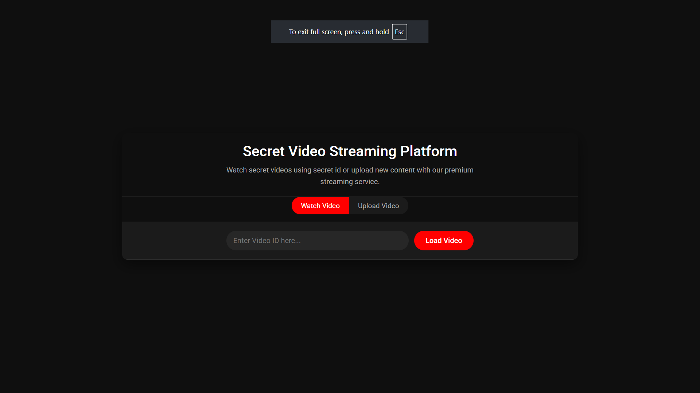
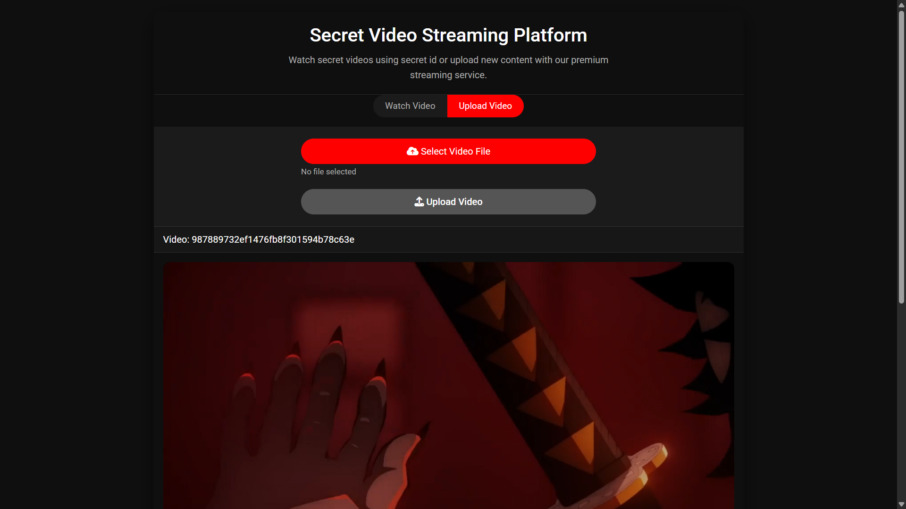
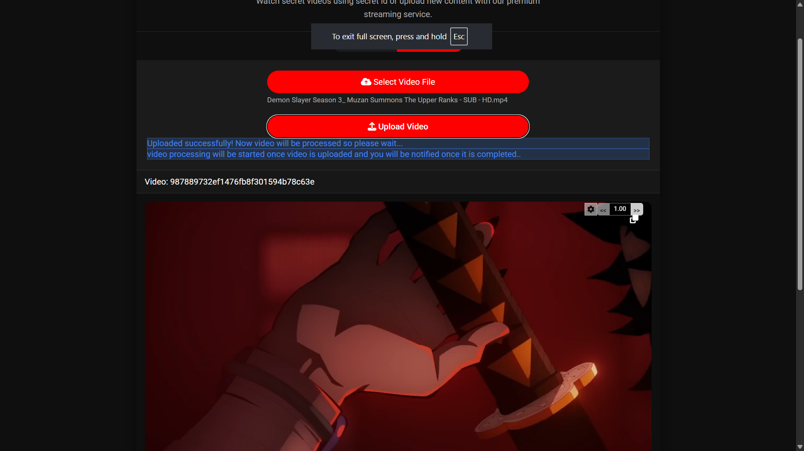
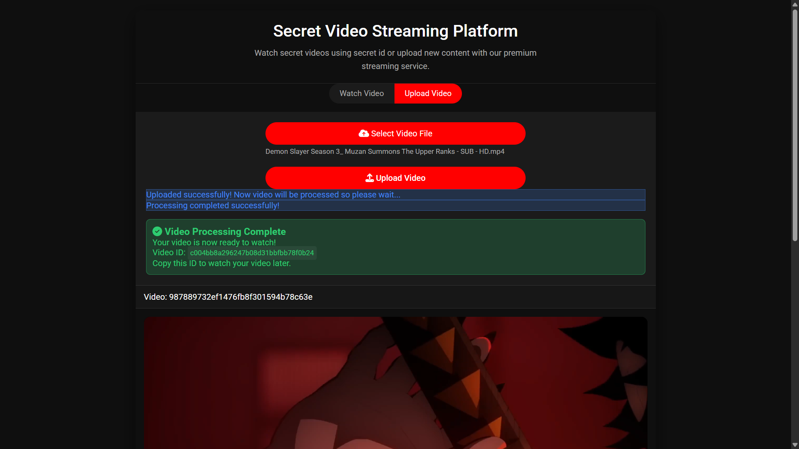
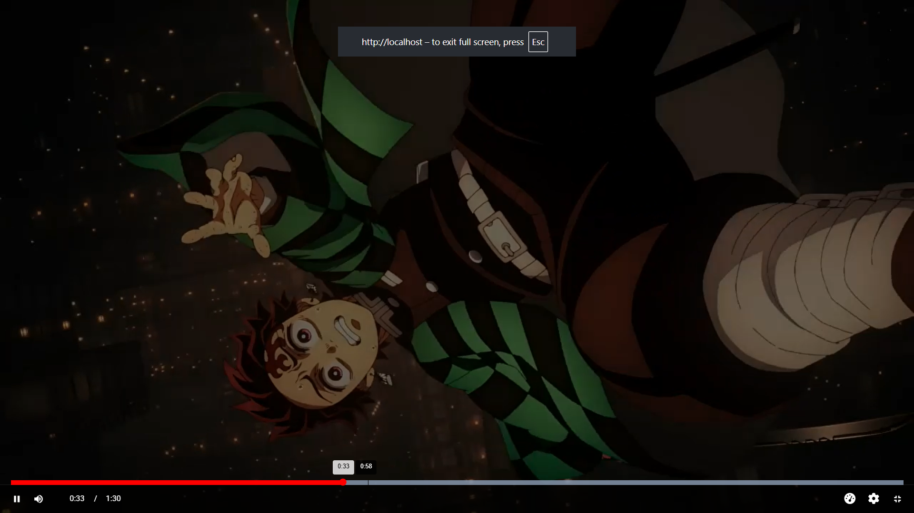
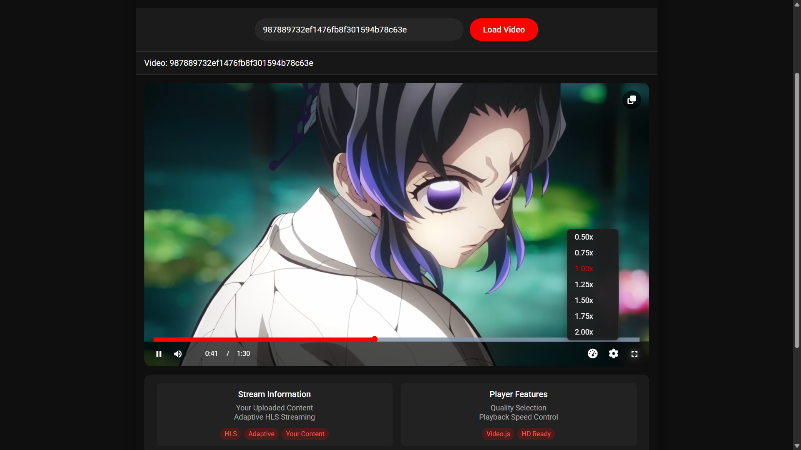
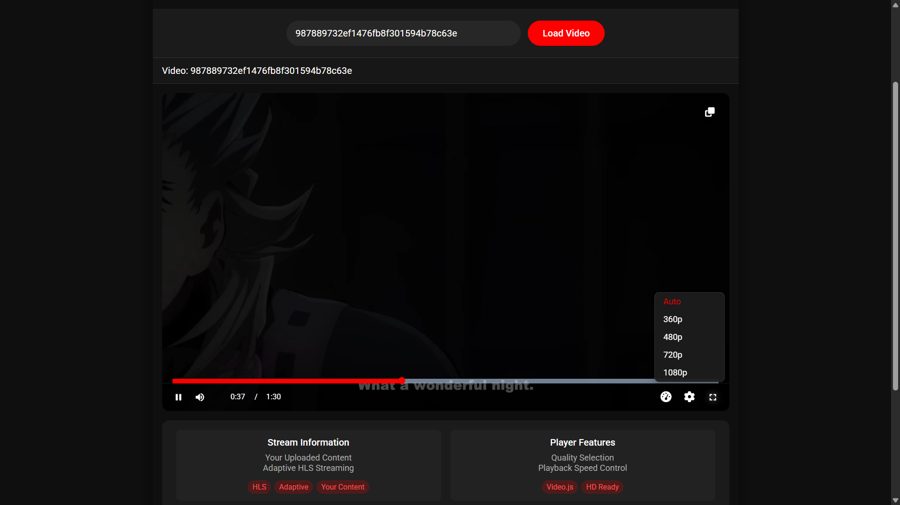

# KeyFlicks - Secure HLS Video Streaming Platform

[](https://golang.org/)
[](https://www.python.org/)
[](https://www.docker.com/)

A high-performance, secure video streaming application built with Go (Gin) and Python (Celery). Upload videos, have them automatically transcoded into adaptive HLS format, and stream them privately using unique IDs and signed URLs.

## Overview

KeyFlicks provides a private video hosting solution. Users can upload video content, which is then processed in the background into multiple quality levels suitable for adaptive streaming (HLS). Each uploaded video is assigned a unique ID. Playback is secured using dynamically generated signed URLs for video segments, ensuring only users with the correct video ID can view the content.

## Features

* **Secure Upload:** Direct-to-storage uploads using pre-signed URLs (MinIO/S3).
* **Background Transcoding:** Asynchronous video processing using Celery and FFmpeg into multiple HLS resolutions.
* **Adaptive Bitrate Streaming (HLS):** Smooth playback experience that adapts to the viewer's network conditions.
* **Private Access:** Videos are only accessible via their unique generated ID.
* **Signed Segment URLs:** HLS video segments are protected by expiring signed URLs generated on-the-fly and verified by Nginx (`secure_link`).
* **Real-time Status Updates:** Frontend receives processing status updates via Server-Sent Events (SSE).
* **Caching:** Redis is used for caching video processing status and as the Celery broker/backend.
* **Scalable Architecture:** Built with Go for high-concurrency request handling and Python/Celery for distributed task processing.

## Architecture

The application follows this flow:

1.  **Upload Request:** The Go API generates a pre-signed URL for direct upload to a `pending` bucket in MinIO.
2.  **Direct Upload:** The client uploads the video file directly to MinIO using the pre-signed URL.
3.  **Upload Notification:** MinIO sends a webhook notification (configured manually) to the Go API upon successful upload.
4.  **Task Queuing:** The Go API receives the webhook, validates it, and dispatches a transcoding task (with video ID and S3 key) to the `video_tasks` queue in Redis via `gocelery`.
5.  **Video Processing:** A Python Celery worker picks up the task from the Redis queue. It downloads the video from the `pending` bucket, uses FFmpeg to transcode it into multiple HLS resolutions, and uploads the resulting `.m3u8` playlists and `.ts` segments to a `streaming` bucket in MinIO.
6.  **Status Updates:** During processing, the worker publishes status updates (e.g., "processing", "ready", "failed") to a Redis Pub/Sub channel specific to the video ID.
7.  **SSE Connection:** The client connects to the Go API's SSE endpoint `/api/stream-status/{video_id}`. The API subscribes to the corresponding Redis Pub/Sub channel and streams status updates back to the client.
8.  **Playback Request:** When a user requests to watch a video (`/api/master/{video_id}`), the Go API generates a master HLS playlist containing URLs to the variant playlists (e.g., `/api/playlist/{video_id}/1080p`).
9.  **Variant Playlist Request:** The player requests a specific variant playlist. The Go API fetches the corresponding `.m3u8` file from the `streaming` bucket, dynamically generates signed URLs (using a secret key) for each `.ts` segment listed within it, and returns the modified playlist.
10. **Segment Request:** The player requests a video segment using the signed URL (e.g., `/videos/{video_id}/1080p/segment_1.ts?sig=...&st=...`).
11. **Nginx Verification & Serving:** Nginx receives the segment request, uses the `secure_link` module to verify the signature and expiration timestamp. If valid, Nginx proxies the request to MinIO to serve the file; otherwise, it returns a 403 Forbidden error. Nginx can also cache these segments.

## Technology Stack

* **Backend API:** Go (Golang) with Gin framework
* **Background Worker:** Python with Celery
* **Video Processing:** FFmpeg
* **Object Storage:** MinIO (S3-compatible)
* **Cache / Message Broker:** Redis
* **Reverse Proxy / Segment Server:** Nginx (with `secure_link` module)
* **Deployment:** Docker (for Redis), Manual setup for other components

## Project Structure

/keyflicks_app
├── cmd/api/ # Main Go application entrypoint (main.go)
├── internals/ # Internal Go packages (handlers, routes, store, celery, cache, etc.)
│ ├── handlers/
│ ├── routes/
│ ├── store/
│ ├── celery/
│ └── cache/
├── worker_app/ # Python Celery worker code
│ ├── app/
│ │ ├── celery_app.py # Celery app definition
│ │ └── tasks.py # Celery task definitions
│ ├── requirements.txt
│ └── ...
├── nginx/ # Example Nginx configuration files and frontend files
├── Assets/ # Contains images and screenshots
├── minio_streaming_bucket_policy.json # MinIO bucket policy
├── go.mod # Go module definition
├── go.sum # Go module checksums
└── README.md # This file


## Setup & Installation

### Prerequisites

* [Docker](https://docs.docker.com/get-docker/) (for running Redis)
* [Go](https://golang.org/doc/install/) (version 1.22+ recommended)
* [Python](https://www.python.org/downloads/) (version 3.10+ recommended) & `pip`
* [FFmpeg](https://ffmpeg.org/download.html) (must be installed and available in the system PATH where the Celery worker runs)
* [MinIO Server](https://min.io/docs/minio/linux/index.html#download-minio-server) (running locally or via Docker)
* [Nginx](https://nginx.org/en/docs/install.html) (with the `http_secure_link_module` compiled in or installed)
* [MinIO Client (mc)](https://min.io/docs/minio/linux/reference/minio-mc.html) (for bucket policy and webhook configuration)

### Configuration

1.  **Clone the Repository:**
    ```bash
    git clone https://github.com/Rohit128256/keyflicks_app.git
    cd keyflicks_app
    ```

2.  **Environment Variables:** Create a `.env` file in the project root with your actual settings:
    ```
    MINIO_ENDPOINT=http://localhost:9000
    MINIO_ROOT_USER=your-minio-username
    MINIO_ROOT_PASSWORD=your-minio-password
    REDIS_URL=redis://localhost:6379/0
    STREAMING_BUCKET=streaming
    PENDING_BUCKET=pending
    URI_SIGNATURE_SECRET=your-strong-random-secret-key
    GIN_MODE=debug
    ```

### Running the Services

You need to run Redis, MinIO, Nginx, the Celery Worker, and the Go API.

1.  **Run Redis via Docker:**
    ```bash
    docker run -d --name keyflicks-redis -p 6379:6379 redis:alpine
    ```

2.  **Run and Configure MinIO:**
    * Follow the official MinIO documentation to run it either directly or via Docker.
    * Access the MinIO console (usually `http://localhost:9001`).
    * Create the buckets specified in your `.env` file:
      ```bash
      # Using mc command line tool (after configuring alias)
      mc mb myminio/pending
      mc mb myminio/streaming
      ```

    * **Apply Streaming Bucket Policy:**
      ```bash
      # Configure mc alias if not already done
      mc alias set myminio http://localhost:9000 your-minio-username your-minio-password
      
      # Apply the bucket policy from the project file
      mc anonymous set-json minio_streaming_bucket_policy.json myminio/streaming
      ```

    * **Configure Webhook for Upload Notifications:**
      ```bash
      # Set webhook for the pending bucket to notify your Go API
      mc event add myminio/pending arn:minio:sqs::PRIMARY:webhook --event put
      
      # Configure the webhook endpoint (replace with your actual Go API URL)
      mc admin config set myminio notify_webhook:PRIMARY endpoint="http://your-go-api-ip:8000/api/s3-webhook"
      
      # Restart MinIO to apply configuration changes
      mc admin service restart myminio
      ```

3.  **Configure and Run Nginx:**
    * Install Nginx with `http_secure_link_module` (ensure this module is included in your Nginx build).

    ### For Linux Users:
    ```bash
    # Copy the nginx configuration to your Nginx sites
    sudo cp nginx/nginx.conf /etc/nginx/sites-available/keyflicks
    sudo ln -s /etc/nginx/sites-available/keyflicks /etc/nginx/sites-enabled/
    
    # Copy frontend files to the appropriate directory
    sudo cp -r nginx/html/* /usr/share/nginx/html/
    ```

    ### For Windows Users:
    ```bash
    # Copy the nginx configuration (replace C:\nginx with your actual nginx install path)
    copy nginx\nginx.conf C:\nginx\conf\nginx.conf
    
    # Copy frontend files to nginx html directory
    xcopy nginx\html\* C:\nginx\html\ /E /Y
    ```

    * The Nginx configuration already includes:
      - Serving frontend static files from the nginx/html directory
      - Proxy pass for API requests to the Go application (localhost:8000)
      - Secure link verification for video segments
      - Caching configuration for video segments

    * Update the configuration if needed with your `secure_link_secret` (from `.env` file) and verify the paths match your setup.

    * Start/Restart Nginx:

    **Linux:**
    ```bash
    sudo nginx -t
    sudo systemctl restart nginx
    ```

    **Windows:**
    ```bash
    # Navigate to nginx directory
    cd C:\nginx
    
    # Test configuration
    nginx -t
    
    # Stop nginx (if running)
    nginx -s stop
    
    # Start nginx
    start nginx
    ```

    **Alternative Windows approach:** You can also double-click `nginx.exe` or run it from command line without parameters to start it in the background.

    The frontend will be accessible at `http://localhost` once Nginx is running properly.

4.  **Run the Python Celery Worker:**
    ```bash
    cd worker_app
    python3 -m venv venv
    source venv/bin/activate
    pip install -r requirements.txt
    python -m celery -A app.celery_app:celery worker --pool=solo --loglevel=info --queues=video_tasks --hostname=wr_1
    ```

5.  **Build and Run the Go API:**
    ```bash
    cd cmd/api
    go build -o ../../keyflicks_api
    cd ../..
    ./keyflicks_api
    ```

### Accessing the Application

* The application frontend is now accessible via Nginx at `http://localhost` (or your configured domain)
* The frontend interface allows you to upload videos and play them back
* API endpoints are available under `/api/...`
* Video segments are served via `/videos/...`

## Application Screenshots

### Upload Interface & Home Screen


*Main application interface showing the home screen*


*Video upload section with drag-and-drop functionality*


*Successfully uploaded video ready for playback*


*Real-time upload progress and processing status*

### Video Player Features


*Video playback in fullscreen mode*


*Advanced playback controls and timeline*


*Adaptive bitrate streaming with resolution selection*

## Usage

1. **Access the Application:** Open your browser and navigate to `http://localhost` (or your configured domain)
2. **Upload Video:** Use the web interface to upload video files - the frontend will handle generating upload URLs and monitoring processing status
3. **Watch Videos:** Once processing is complete, videos will appear in the interface and can be played back directly

### API Endpoints

* **Generate Upload URL:** `POST /api/generate-upload-url/{filename}`
* **Watch Processing Status:** `GET /api/stream-status/{video_id}` (SSE endpoint)
* **Check Final Status:** `GET /api/status/{video_id}`
* **Get Master Playlist:** `GET /api/master/{video_id}` (Use this URL in an HLS player)
* **Get Variant Playlist:** `GET /api/playlist/{video_id}/{resolution}` (Called by the player)

### Example Workflow

1. Use the frontend interface or call `/api/generate-upload-url/{filename}` to get a pre-signed upload URL
2. Upload your video file directly to the provided MinIO URL
3. Connect to `/api/stream-status/{video_id}` to monitor processing progress
4. Once processing is complete, use `/api/master/{video_id}` as the playback URL in any HLS-compatible video player

The player will automatically handle requests for variant playlists and segments through the secured endpoints.
