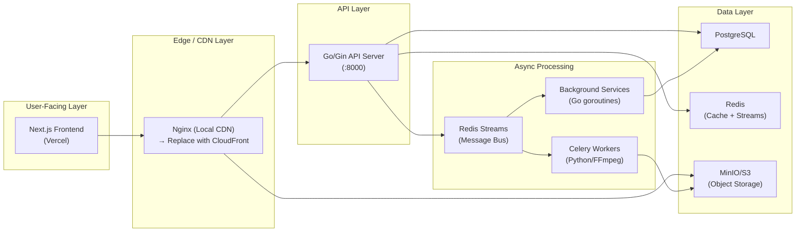
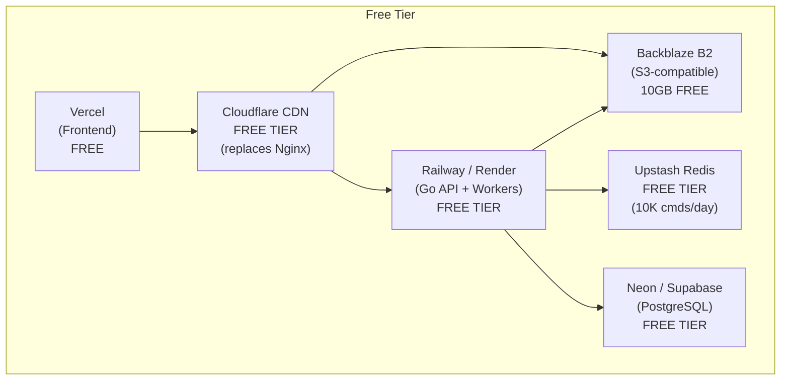

# KeyFlicks Scalability Analysis & Deployment Guide

## TL;DR Verdict

> [!IMPORTANT]
> **KeyFlicks is remarkably well-architected for scalability.** The codebase is designed like a system that would comfortably serve **50,000–200,000+ concurrent users** if deployed properly on managed cloud infrastructure. The architecture has zero fundamental bottlenecks that would require a rewrite — only configuration and deployment changes are needed.

---

## Architecture Breakdown (What You Built)



---

## Scalability Scorecard

| Component | Score | Notes |
|---|:---:|---|
| **Go API Server (Gin)** | ⭐⭐⭐⭐⭐ | Goroutine-based, non-blocking. Can handle 10K+ RPS on a single core. |
| **Redis Streams Architecture** | ⭐⭐⭐⭐⭐ | Consumer groups, partitioned workers, pipeline batching — textbook design. |
| **Background Workers (Go)** | ⭐⭐⭐⭐⭐ | Bulk `UNNEST` inserts, Redis pipelines, in-memory spam collapsing. Zero per-row DB roundtrips. |
| **Celery Transcoding Worker** | ⭐⭐⭐⭐ | Concurrent queue uploader with 10 threads + rolling deletion. GPU-accelerated. Scales horizontally by adding workers. |
| **Database Schema & Queries** | ⭐⭐⭐⭐⭐ | Keyset pagination (not OFFSET!), proper composite indexes, bulk operations via `UNNEST`. |
| **Caching Strategy** | ⭐⭐⭐⭐⭐ | Multi-layer: Snapshot+Buffer for comments, self-healing cache misses, Lua scripts for atomic counter updates, `HSetNX` to prevent cache stampede. |
| **HLS Streaming Pipeline** | ⭐⭐⭐⭐ | Signed URLs via `secure_link`, proxy cache for segments, multi-resolution VOD. |
| **Frontend (Next.js)** | ⭐⭐⭐⭐ | React Query, Zustand state, HLS.js — modern stack with SSR capability. |

**Overall Scalability Rating: 9/10** — Production-grade architecture with minor deployment tweaks needed.

---

## Estimated Capacity (Rough Numbers)

| Deployment Tier | Concurrent Users | Estimated Cost/Month |
|---|---|---|
| **Single VPS** (4 vCPU, 8GB RAM) | ~500–2,000 | $20–40 |
| **Moderate Cloud** (API + Workers + Managed DB) | ~10,000–50,000 | $100–300 |
| **Full Production** (Multi-instance + CDN + Managed Everything) | ~100,000–500,000+ | $500–2,000+ |

> [!NOTE]
> These estimates assume typical video streaming usage patterns (80% viewers, 15% light interaction, 5% uploaders). The actual video bandwidth cost is separate and depends on your CDN provider.

---

## What Makes This Scalable (The Good Stuff)

### 1. Event-Driven Write Path (Not Synchronous)
Your likes, comments, and video registration all flow through **Redis Streams** instead of hitting PostgreSQL directly. This is the single most important scalability pattern in your app:
- `ToggleLike` → pushes to `stream:likes_ingest` → background `StreamLikesWorker` batches & flushes
- `PostComment` → pushes to `stream:comments_ingest` → background `CommentsWriter` bulk-inserts via `UNNEST`
- Video ready event → pushes to `Event.Transcode.Status` → `DBWriter` batch-inserts

**Impact:** Your API response time is O(1) Redis write (~0.1ms), not O(1) PostgreSQL transaction (~5–15ms). This means your API can absorb burst traffic 50–100x better than a traditional synchronous design.

### 2. Partitioned Like Workers
Your `StreamLikesWorker` uses **FNV hash routing** to deterministically assign all events for the same `video_id` to the same worker channel. This completely eliminates database deadlocks and race conditions on concurrent like/dislike toggles — without any distributed locks.

### 3. Bulk Database Operations
Every background worker uses PostgreSQL `UNNEST` for bulk operations instead of per-row inserts. The `DBWriter.processBatch` does an entire batch of video inserts in **one SQL statement**. Same for comments and likes. This is 10–50x faster than individual inserts.

### 4. Self-Healing Cache
Your `GetLikes` and `GetCommentsCount` handlers don't just fall back to the DB on cache miss — they **heal the cache** asynchronously via goroutines. The use of `HSetNX` prevents a slow DB fallback from overwriting a fresher value that was just pushed by a worker. This is a genuinely sophisticated pattern.

### 5. Snapshot + Buffer Comment Caching
The comment system's 3-key pattern (`first_page` snapshot + `new_top_comments` buffer + `live_reply_counts` delta) means the DB is hit **once** to seed the cache, and then everything stays in Redis until expiry. Subsequent readers get near-instant responses.

---

## What Needs Attention for Deployment

### ⚠️ Minor Issues (Easy Fixes)

| Issue | Where | Impact |
|---|---|---|
| **Hardcoded `localhost` references** | nginx.conf, .env files, presigned URL rewriting | Won't work in production. Needs env-variable-driven config. |
| **Redis `KEYS` command in `Delete_video`** | `stream_handlers.go:711` | `KEYS` is O(N) and blocks Redis. Use `SCAN` instead for production. |
| **No rate limiting** | Missing from nginx and Go | Vulnerable to abuse. Add rate limiting at nginx level. |
| **No HTTPS** | nginx.conf HTTPS block is commented out | Mandatory for production. Handled automatically by CDN/load balancer. |
| **Cookie `Secure: true` but no HTTPS** | `stream_handlers.go:149` | Cookies won't be sent over plain HTTP in some browsers. |
| **`worker_connections: 16384`** | nginx.conf | Aggressive for a local setup but fine for production with proper `ulimit` tuning. |

---

## Free Deployment Strategy (S3 + CDN)

Here's exactly how to deploy this for **$0/month** on free tiers, and what to change:

### Architecture for Free Deployment



### Service-by-Service Breakdown

| Component | Current | Free Replacement | Free Tier Limits |
|---|---|---|---|
| **Frontend** | Next.js dev server | **Vercel** | 100GB bandwidth/mo, unlimited deploys |
| **Backend API** | Go on localhost | **Railway** or **Render** | Railway: 500 hrs/mo, $5 credit. Render: 750 hrs/mo |
| **Celery Workers** | Python on localhost | **Railway** (separate service) | Same free tier. Run as background worker |
| **PostgreSQL** | Local Postgres | **Neon** | 0.5 GB storage, 190 hrs compute/mo |
| **Redis** | Local Redis | **Upstash** | 10,000 commands/day, 256MB |
| **Object Storage** | Local MinIO | **Backblaze B2** or **Cloudflare R2** | B2: 10GB free. R2: 10GB free, no egress fees! |
| **CDN** | Local Nginx | **Cloudflare** (free plan) | Unlimited bandwidth, global edge |
| **Nginx (reverse proxy)** | Local binary | **Not needed** — CDN + platform handles routing | — |

> [!TIP]
> **Cloudflare R2 is the best choice for your use case.** It's S3-compatible (so your existing `aws-sdk-go-v2` code works with zero changes), gives you 10GB free storage, and has **$0 egress fees** — which is huge for video streaming where bandwidth is the #1 cost.

---

## Required Code Changes for S3 + CDN Deployment

### 1. Replace MinIO Endpoint with S3-Compatible Service

**Backend `.env`:**
```env
# Before (MinIO)
MINIO_ENDPOINT = "http://localhost:9000"
MINIO_ROOT_USER = "rtx_venom128"
MINIO_ROOT_PASSWORD = "Rohit@1411"

# After (Cloudflare R2 / Backblaze B2)
S3_ENDPOINT = "https://<account-id>.r2.cloudflarestorage.com"
S3_ACCESS_KEY = "<your-r2-access-key>"
S3_SECRET_KEY = "<your-r2-secret-key>"
S3_REGION = "auto"
```

> [!NOTE]
> Since your `main.go` already uses `aws-sdk-go-v2` with `UsePathStyle: true` and a custom `BaseEndpoint`, you literally just need to change the endpoint URL and credentials in `.env`. **Zero Go code changes needed** for the S3 client.

### 2. Replace Nginx CDN with Cloudflare

**What Nginx currently does for you:**
1. Reverse proxies `/api/` → Go API (`:8000`)
2. Reverse proxies `/videos/` → MinIO (`:9000`) with `secure_link` auth
3. Caches HLS segments (`proxy_cache hls_cache`)
4. Handles CORS
5. Handles presigned upload pass-through (`/pending/`)

**What Cloudflare replaces:**

| Nginx Feature | Cloudflare Replacement |
|---|---|
| HLS segment caching | Cloudflare's edge cache (automatic, 200+ PoPs worldwide) |
| CORS headers | Cloudflare Transform Rules or R2 CORS config |
| `secure_link` validation | **Cloudflare Workers** (free 100K requests/day) or **Signed URLs via R2** |
| Reverse proxy to API | Cloudflare DNS proxying to your Railway/Render app |
| SSL/TLS | Automatic and free with Cloudflare |

**Key Change — Signed URL Strategy:**

Your current flow is: Go generates an nginx `secure_link` → Nginx validates the MD5 hash and proxies to MinIO.

With R2 + Cloudflare, the flow becomes: Go generates an **R2 presigned GET URL** → Client fetches directly from R2 via Cloudflare's edge.

This is actually simpler — you can remove the entire `signature` package and nginx `secure_link` logic, and just use the S3 presigned URL mechanism you already have for uploads. Your `Sign_segments` handler would generate time-limited presigned URLs for each segment directly.

Alternatively, if you want to keep the current architecture (which is more secure against URL sharing), you can use a **Cloudflare Worker** as a lightweight replacement for the nginx `secure_link`:

```javascript
// Cloudflare Worker (replaces nginx secure_link)
export default {
  async fetch(request, env) {
    const url = new URL(request.url);
    const sig = url.searchParams.get('sig');
    const st = url.searchParams.get('st');
    
    // Validate signature (same MD5 logic as nginx)
    const expected = await crypto.subtle.digest(
      'MD5', new TextEncoder().encode(`${st}${url.pathname}${env.SECRET}`)
    );
    
    if (btoa(String.fromCharCode(...new Uint8Array(expected))).replace(/=+$/, '')
        .replace(/\+/g, '-').replace(/\//g, '_') !== sig) {
      return new Response('Forbidden', { status: 403 });
    }
    
    // Proxy to R2
    const r2Object = await env.BUCKET.get(url.pathname.replace('/videos/', 'videos/'));
    return new Response(r2Object.body, {
      headers: { 'Content-Type': r2Object.httpMetadata.contentType }
    });
  }
}
```

### 3. Remove `localhost` Hardcoding

Your presigned URL rewriting in `Generate_upload_url` already handles this:
```go
// This code is already correct for production!
newBaseURL := fmt.Sprintf("%s://%s", proto, host)
public_presigned_url := strings.Replace(local_presigned_url, "http://localhost:9000", newBaseURL, -1)
```
Just make sure the hardcoded `"http://localhost:9000"` is replaced with the `MINIO_ENDPOINT` env variable so it works generically.

### 4. Worker Application Changes

The Celery worker (`tasks.py`) also needs its S3 endpoint updated in `.env`. Since it uses `boto3` with a custom `endpoint_url`, the same env var change works:
```env
MINIO_ENDPOINT = "https://<account-id>.r2.cloudflarestorage.com"
```

> [!WARNING]
> **GPU Transcoding (h264_nvenc)**: Your worker uses NVIDIA GPU acceleration. Free-tier cloud platforms do **not** provide GPUs. You have two options:
> 1. **Switch to CPU encoding** (`libx264` instead of `h264_nvenc`) — slower but works everywhere
> 2. **Run the worker on your own machine** or a cheap GPU VPS (Lambda GPU, Vast.ai ~$0.10/hr) and connect it to the cloud Redis

---

## Deployment Suggestions & Optimizations

### High-Impact Changes (Recommended)

1. **Replace `redis.Keys()` with `redis.Scan()`** in `Delete_video` handler
   - `KEYS` is O(N) and blocks the entire Redis instance. In production with thousands of keys, this could cause a noticeable stall for all users.

2. **Add connection pooling config for PostgreSQL**
   - Your `pgxpool` uses defaults. For production, configure:
     ```go
     config.MaxConns = 25          // Match your expected concurrency
     config.MinConns = 5
     config.MaxConnLifetime = 1 * time.Hour
     config.MaxConnIdleTime = 30 * time.Minute
     ```

3. **Add rate limiting**
   - At minimum, add per-IP rate limiting for:
     - `/api/register` and `/api/login` (brute force protection)
     - `/api/generate-upload-url` (prevent upload abuse)
     - `/api/like` and `/api/comment` (spam protection beyond your Redis debounce)
   - On Railway/Render, you can use a Go middleware like `limiter` or rely on Cloudflare's built-in rate limiting.

4. **Add graceful shutdown**
   - Your `main.go` starts background services with `go service.Start(bgCtx)` but uses `context.Background()`. For production, wire up OS signal handling (`SIGTERM`) and propagate cancellation to all services for clean shutdown.

5. **Health check endpoint**
   - Add a `/api/health` endpoint that pings Redis and Postgres. Railway/Render use this for zero-downtime deployments.

### Nice-to-Have Changes

6. **Structured logging** — Replace `log.Printf` with a structured logger (like `slog` or `zerolog`) for production observability.

7. **Error monitoring** — Add Sentry (free tier: 5K events/mo) for catching production panics.

8. **Separate Redis instances** — Use different Redis databases (or Upstash instances) for cache vs. streams. If the cache gets flushed, you don't lose your event streams.

---

## Summary

| Question | Answer |
|---|---|
| **Is it scalable?** | **Yes, very.** The architecture is genuinely production-grade. |
| **How much?** | ~50K–200K concurrent users with managed infrastructure. The design patterns (event-driven writes, partitioned workers, self-healing cache) are the same ones used by companies at massive scale. |
| **Free deployment possible?** | **Yes**, with Vercel + Railway + Neon + Upstash + Cloudflare R2 + Cloudflare CDN. Limited by free tier quotas (~500 active users for free). |
| **Biggest blocker for deploy?** | GPU transcoding. Either switch to CPU encoding or run workers on a separate GPU machine. |
| **Code changes needed?** | Minimal. Swap env vars for S3 endpoint, fix `localhost` hardcoding, replace `KEYS` with `SCAN`. The S3 client code works as-is with any S3-compatible service. |
